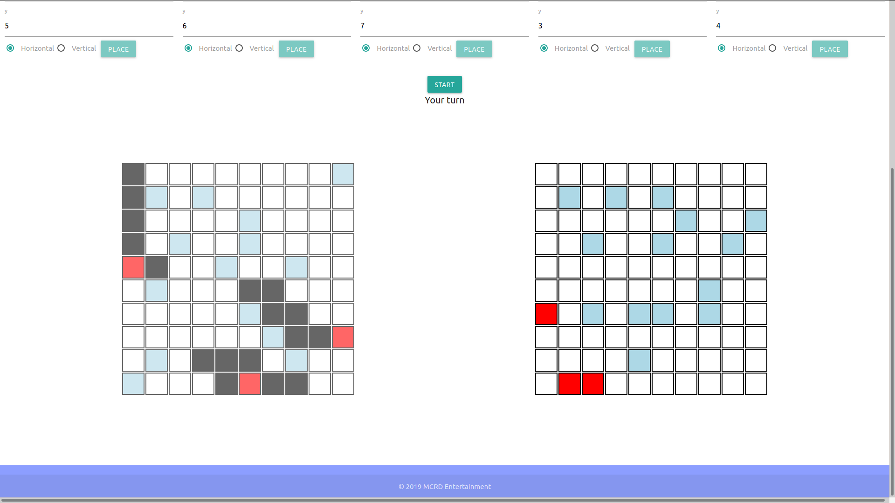

# Battleship (Using JavaScript)

> Web version of the battleship game.

## Built With

- JavaScript (ES6)
- webpack
- jest
- NodeJS, npm, yarn, eslint

## Live Demo

[Live Demo Link](#)

## Getting Started

To get a local copy up and running follow these simple example steps.

### Prerequisites
You will need to have a recent version of [Node.js](https://nodejs.org/en/), [jest](https://jestjs.io/) and optionally [eslint](https://www.npmjs.com/package/eslint) installed.

### Setup
run `git clone https://github.com/mcrd25/battleship.git`  
run `cd battleship`

### Install
run `yarn install` or `npm install`

### Usage
run `yarn start` or `npm run start` to launch app server  
run `yarn build` or `npm run build` to build app for production

### Deployment
After building app for production it can deployed by opening index.html or adding files in dist to any webserver.

## Authors

👤 **Maya Douglas (mcrd25)**

- Github: [@mcrd25](https://github.com/mcrd25)
- Twitter: [@mcrd25](https://twitter.com/mcrd25)
- Linkedin: [linkedin](https://linkedin.com/in/mayadouglas)

## 🤝 Contributing

Contributions, issues and feature requests are welcome!

Feel free to check the [issues page](issues/).

## Show your support

Give a ⭐️ if you like this project!

## Acknowledgments

- The app was inspired by [this project](https://www.theodinproject.com/courses/javascript/lessons/battleship)

## 📝 License

This project is [MIT](LICENSE) licensed.